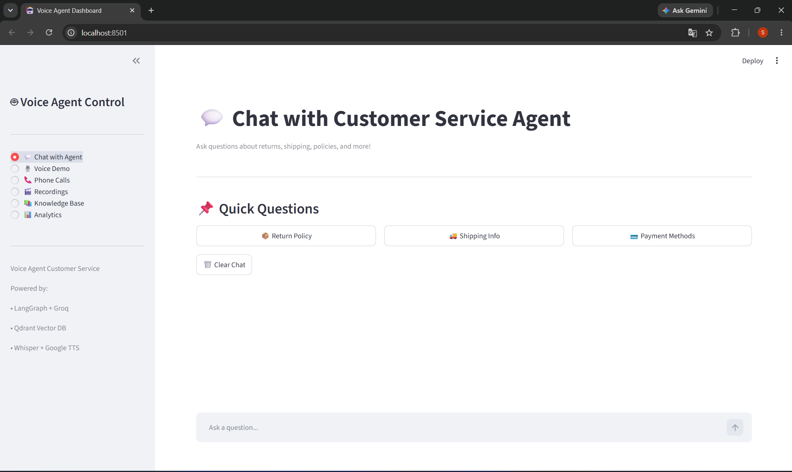
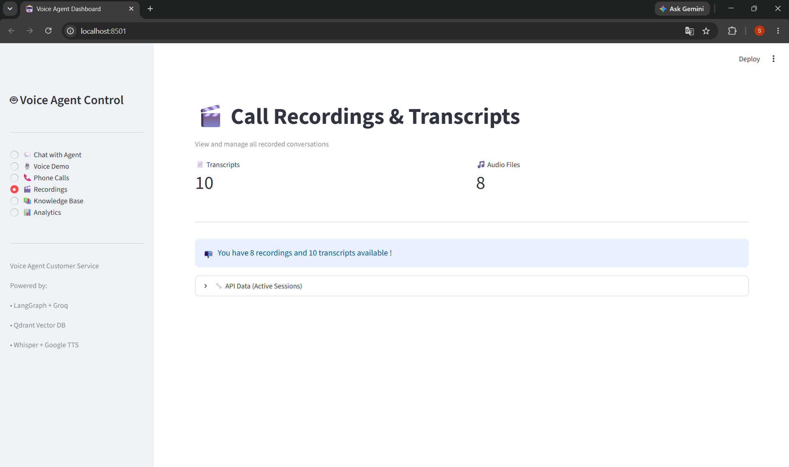

<div align="center">

# 🤖 AI Voice Agent for Customer Service

An intelligent voice agent that handles real customer service phone calls using natural language processing, retrieval-augmented generation (RAG), and telephony integration.

[](https://www.python.org/)
[](https://fastapi.tiangolo.com/)
[](LICENSE)

---

## ✨ Features

- 🎙️ **Real-time Voice Conversations** - Handles actual phone calls through Twilio
- 🧠 **AI-Powered Responses** - Uses LangGraph with Llama 3.3 for intelligent conversation flow
- 📚 **Knowledge Retrieval** - RAG implementation with Qdrant vector database
- 🗣️ **Natural Speech Processing** - Whisper for STT and Google TTS for speech synthesis
- 📊 **Interactive Dashboard** - Streamlit-based monitoring and testing interface
- 📝 **Automatic Transcription** - Saves complete conversation transcripts
- 🌍 **Multi-language Support** - TTS available in 8+ languages

---

## 🏗️ Architecture

```
┌─────────────┐
│   Customer  │
│    Phone    │
└──────┬──────┘
       │
       │ ① Phone Call
       ▼
┌─────────────────────────────────────────┐
│           Twilio (Telephony)            │
│  • Receives incoming calls              │
│  • Converts speech to text              │
│  • Sends webhooks to FastAPI            │
└──────────────┬──────────────────────────┘
               │
               │ ② HTTP Webhook
               ▼
┌─────────────────────────────────────────┐
│         FastAPI Server (Backend)        │
│  • Processes speech input               │
│  • Routes to AI agent                   │
│  • Returns voice response               │
└──────────────┬──────────────────────────┘
               │
               │ ③ Query Processing
               ▼
┌─────────────────────────────────────────┐
│      LangGraph Agent (Orchestration)    │
│  ┌──────────────────────────────────┐   │
│  │  1. Intent Classification        │   │
│  │     ↓                             │   │
│  │  2. Context Retrieval (RAG)      │   │
│  │     ↓                             │   │
│  │  3. Response Generation          │   │
│  │     ↓                             │   │
│  │  4. Escalation Check             │   │
│  └──────────────────────────────────┘   │
└──────┬───────────────────┬──────────────┘
       │                   │
       │ ④ Retrieval       │ ⑤ LLM Call
       ▼                   ▼
┌──────────────┐    ┌─────────────┐
│   Qdrant     │    │    Groq     │
│ Vector Store │    │  (Llama 3)  │
│              │    │             │
│ • FAQs       │    │ • Reasoning │
│ • Policies   │    │ • Response  │
│ • Knowledge  │    │   Gen       │
└──────────────┘    └─────────────┘
       │                   │
       └─────────┬─────────┘
                 │
                 │ ⑥ Response
                 ▼
┌─────────────────────────────────────────┐
│     Text-to-Speech (Google TTS)         │
│  • Converts text to natural speech      │
└──────────────┬──────────────────────────┘
               │
               │ ⑦ Audio Response
               ▼
┌─────────────────────────────────────────┐
│         Twilio (Return Audio)           │
└──────────────┬──────────────────────────┘
               │
               │ ⑧ Voice Response
               ▼
┌──────────────┐
│   Customer   │
│    Hears     │
│   Response   │
└──────────────┘

Additional Components:
┌──────────────────────────────────────────┐
│      Streamlit Dashboard (Frontend)      │
│  • Chat interface for testing            │
│  • Voice demo playground                 │
│  • Call recordings viewer                │
│  • Analytics and metrics                 │
└──────────────────────────────────────────┘

┌──────────────────────────────────────────┐
│     Local Storage (Persistence)          │
│  • Call transcripts (JSON)               │
│  • Knowledge base documents              │
│  • Conversation history                  │
└──────────────────────────────────────────┘
```

---

## 🛠️ Tech Stack

### **Core Framework**
- **Python 3.11+** - Primary language
- **FastAPI** - High-performance web framework
- **LangGraph** - Agent workflow orchestration
- **LangChain** - LLM framework and tooling

### **AI & ML**
- **Groq Cloud** - Lightning-fast LLM inference (Llama 3.3)
- **OpenAI Whisper** - Speech-to-text transcription
- **Google TTS (gTTS)** - Text-to-speech synthesis
- **Sentence Transformers** - Text embeddings for RAG

### **Data & Storage**
- **Qdrant Cloud** - Vector database for knowledge retrieval
- **JSON Storage** - Local conversation transcripts

### **Telephony & Voice**
- **Twilio** - Phone number provisioning and call handling
- **ngrok** - Local development tunneling (for testing)

### **Frontend & Monitoring**
- **Streamlit** - Interactive dashboard and testing interface

---


## 📁 Project Structure

```
ai-voice-agent/
├── src/
│   ├── agents/
│   │   ├── __init__.py
│   │   └── customer_service_agent.py    # LangGraph agent logic
│   ├── voice/
│   │   ├── __init__.py
│   │   ├── stt.py                       # Speech-to-text (Whisper)
│   │   └── tts.py                       # Text-to-speech (gTTS)
│   ├── rag/
│   │   ├── __init__.py
│   │   └── vector_store.py              # Qdrant integration
│   ├── integrations/
│   │   ├── __init__.py
│   │   └── twilio_handler.py            # Twilio webhook handlers
│   └── utils/
│       ├── __init__.py
│       └── logger.py
├── frontend/
│   └── app.py                           # Streamlit dashboard
├── config/
│   ├── __init__.py
│   └── settings.py                      # Configuration management
├── data/
│   ├── knowledge_base/
│   │   ├── sample_faqs.txt              # Customer service FAQs
│   │   └── policies.txt                 # Company policies
│   └── recordings/                      # Call transcripts (auto-generated)
├── scripts/
│   ├── populate_kb.py                   # Initialize knowledge base
│   └── test_voice.py                    # Test voice components
├── tests/
│   ├── test_agent.py
│   └── test_rag.py
├── .env.example                         # Environment template
├── .gitignore
├── requirements.txt
└── README.md
```

---

## 💡 How It Works

### 1. **Call Handling**
When a customer calls the Twilio number:
- Twilio converts speech to text
- Sends webhook to FastAPI with the transcribed text
- FastAPI routes the query to the LangGraph agent

### 2. **Intent Classification**
The agent analyzes the customer's intent:
- Order tracking
- Returns/refunds
- Shipping inquiries
- Product information
- Complaints (escalated to humans)

### 3. **Knowledge Retrieval (RAG)**
For informational queries:
- Converts query to vector embedding
- Searches Qdrant for relevant documents
- Retrieves top-k most similar passages

### 4. **Response Generation**
The LLM (Llama 3.3 via Groq):
- Receives query + retrieved context
- Generates natural, accurate response
- Follows conversation guidelines (concise, friendly)

### 5. **Voice Response**
- Text response converted to speech via Google TTS
- Audio sent back to Twilio
- Customer hears the response

### 6. **Transcript Logging**
- Full conversation saved as JSON
- Includes timestamps, speaker roles, content
- Accessible via dashboard

---

## 🎨 Dashboard Features

### **Chat Interface**
- Test agent with text queries
- See real-time responses
- Quick action buttons for common questions

### **Voice Demo**
- Text-to-speech testing
- Multi-language support
- Speech-to-text file upload

### **Recordings Viewer**
- Browse all call transcripts
- View conversation history
- Playback audio (if recorded)

### **Knowledge Base Manager**
- Add new documents
- Search existing knowledge
- Manage categories

### **Analytics**
- Call volume metrics
- Response times
- Escalation rates
- Common topics

---

# 📸 Application Preview

## Chat Interface

> 

---

## 🎙️ Voice Demo

[▶️ Watch Voice Demo](./app_preview/Voice_Demo.mp4)

---

## Recordings Viewer

> 

---

## Knowledge Base Manager


> [▶️ Watch Knowledge Base Manager Demo](./app_preview/Knowledge_Base_Manager.mp4)

---

## 📊 Analytics
> [▶️ Watch Analytics Demo](./app_preview/Analysis.mp4)
---

## 🚧 Limitations & Future Improvements

### Current Limitations
- **Memory**: No long-term conversation memory across calls
- **Deployment**: Requires always-on server for production
- **Voice Quality**: Depends on phone connection quality
- **Language**: Primarily optimized for English

### Planned Enhancements
- [ ] Multi-turn conversation memory
- [ ] Sentiment analysis for customer satisfaction
- [ ] Advanced call routing and transfers
- [ ] CRM integration (Salesforce, HubSpot)
- [ ] Real-time analytics dashboard
- [ ] Multi-language conversation support
- [ ] Voice activity detection
- [ ] Call quality monitoring

---
 🎯 Learning Objectives

This project demonstrates practical experience with:

- Retrieval-Augmented Generation (RAG)
- AI Engineering
- Vector Databases
- Semantic Search
- LangGraph Workflows
- Grok APIs
- Production FastAPI Development
- Full Stack AI Applications
- Enterprise Software Architecture


# 📄 License

This project is licensed under the MIT License.

---

# 👨‍💻 Author

## Sonu Yadav

**AI Automation Engineer | AI Agent Developer | GenAI Engineer**

### Tech Stack

- Python
- FastAPI
- LangGraph
- Next.js
- TypeScript
- PostgreSQL
- Qdrant
- Docker
- Google Gemini
- n8n Automation

---

<div align="center">

⭐ If you found this project useful, please consider giving it a Star.

</div>